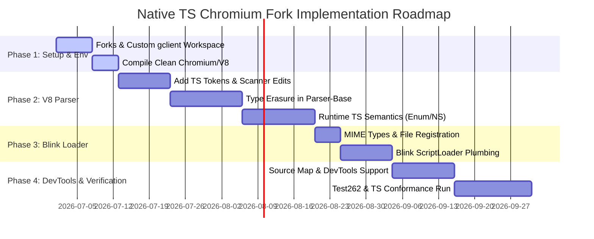

# Implementation Plan: Native TypeScript Chromium & V8 Fork

This plan outlines the direct modification of the V8 JavaScript engine and the Blink rendering engine within the Chromium codebase to natively parse, compile, and execute TypeScript.

---

## 1. Repository & Dependency Management (V8 & Chromium)

Because Chromium is too large to check into a single monolithic Git repository, you must manage your fork using Google's `depot_tools` and custom `.gclient` configurations.

### 1.1 Development Workflow Layout

```
ts-browser-organization/
├── chromium-fork/          # Your public/private fork of chromium/src (GitHub/GitLab)
├── v8-fork/                # Your public/private fork of v8 (GitHub/GitLab)
└── dev-workspace/          # Local developer machine workspace
    ├── depot_tools/        # Google build toolchain
    └── src/                # Managed by gclient, mapping src to your chromium-fork and src/v8 to v8-fork
```

### 1.2 Setting Up the Custom Build Workspace
Rather than checking Chromium into your project root, developers will initialize the codebase using `gclient` pointing to your forks.

1. **Create a custom `.gclient` file** at the root of the workspace:
   ```python
   solutions = [
     {
       "name": "src",
       "url": "https://github.com/your-org/chromium-fork.git", # Your custom Chromium fork
       "deps_file": "DEPS",
       "managed": False,
       "custom_deps": {
         "src/v8": "https://github.com/your-org/v8-fork.git", # Your custom V8 fork
       },
       "custom_vars": {},
     },
   ]
   ```
2. **Sync the code**:
   ```bash
   gclient sync
   ```
   This pulls the exact dependencies specified in your fork's `DEPS` file while replacing the standard `src` and `src/v8` directories with your custom repositories.

---

## 2. V8 Modification Guide (Parser & Engine)

To run TS code, V8's parser and bytecode generator must be modified to recognize TS syntax, process type annotations, and compile TS-only structures (e.g., enums, namespaces).

### 2.1 Adding TS Tokens
You must register new tokens in V8's scanner so it recognizes TS-specific keywords.
* **Target File**: `src/v8/src/parsing/token.h`
* **Modification**: Add TypeScript keywords (like `interface`, `type`, `namespace`, `readonly`, `keyof`, `any`, `number`, `string`, `boolean`) to the token definition macros.

### 2.2 Extending the Scanner
V8's scanner must be updated to skip or correctly categorize TS syntax additions (such as types, type parameters `<T>`, and type assertions).
* **Target Files**: 
  - `src/v8/src/parsing/scanner.h`
  - `src/v8/src/parsing/scanner.cc`

### 2.3 Modifying the Parser to build the AST
V8 uses a recursive descent parser. You must modify it to parse TypeScript declarations.
* **Target Files**:
  - `src/v8/src/parsing/parser-base.h` (shared parsing logic for Parser and PreParser)
  - `src/v8/src/parsing/parser.h`
  - `src/v8/src/parsing/parser.cc`
* **Modification Tasks**:
  - **Type Erasure at Parser Level**: Modify `ParseClassLiteral` and `ParseFormalParameters` to parse type annotations (`: Type`), generic parameters (`<T>`), and interfaces, then discard them so they do not produce execution bytecode.
  - **AST Node Generation for TS Constructs**: For enums and namespaces, generate equivalent runtime AST nodes (e.g., treating `enum E { A }` as a frozen object/lookup table compilation).

### 2.4 Bytecode Generation
If you want to perform runtime type enforcement, type information must survive the parser and be attached to AST nodes, which the Bytecode Generator can use to emit type-check bytecode.
* **Target File**: `src/v8/src/interpreter/bytecode-generator.cc`

---

## 3. Blink Modification Guide (Rendering Engine & Script Loader)

Blink handles HTML parsing, DOM, and script resource fetching. It needs to know that `.ts` files and `<script type="application/typescript">` tags are valid scripts to be fetched and executed.

### 3.1 Enabling MIME Types and File Extensions
Blink restricts script execution to specific MIME types.
* **Target File**: `src/third_party/blink/renderer/platform/network/mime/mime_type_registry.cc`
* **Modification**: Add `text/typescript` and `application/typescript` to the allowed script MIME types.

### 3.2 Updating the Script Loader
Blink's script loading subsystem must recognize `<script type="application/typescript">` (or `type="module"` with `.ts` extensions) and forward them to V8.
* **Target Files**:
  - `src/third_party/blink/renderer/core/script/script_loader.cc`
  - `src/third_party/blink/renderer/core/script/classic_pending_script.cc`
  - `src/third_party/blink/renderer/core/script/module_pending_script.cc`
* **Modification**: Update the type checks to allow TypeScript script types and bypass standard JavaScript-only parsing limits.

---

## 4. Multi-Phase Implementation Roadmap



### Phase 1: Setup and Baseline Verification
* Set up custom forks of `chromium/src` and `v8`.
* Configure the custom `.gclient` workspace.
* Perform a clean build of Chromium (`autoninja -C out/Default chrome`) to establish a performance and compilation baseline.

### Phase 2: Tokenization and V8 Parser Modifications
* Update `token.h` and the scanner to parse types without throwing syntax errors.
* Implement parsing rules in `parser-base.h` to skip type assertions, generics, interfaces, and annotations.
* Transform TypeScript `enum` and `namespace` constructs into their JavaScript ES6 equivalents at the AST generation level.

### Phase 3: Blink Engine Plumbing
* Register TypeScript MIME types in Blink.
* Patch `ScriptLoader` to fetch and load `.ts` script tags directly.
* Verify script load pipeline using simple TS scripts running in the modified Chromium build.

### Phase 4: Verification and Test Suites
* Run **Test262** to ensure JS standards compliance remains unbroken.
* Run a set of custom TS syntax tests compiled from the TypeScript compiler test suites.
